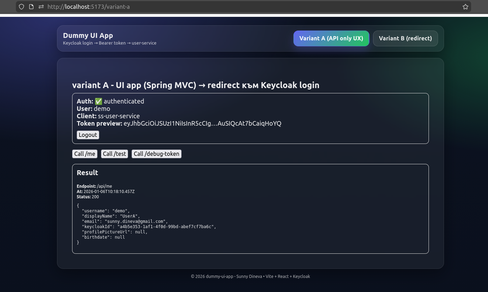

# 🖥️ dummy-ui-app (Reference UI)

React + TypeScript (Vite) reference frontend used to demonstrate **Keycloak login flows** and calling protected APIs with a **Bearer token**.

- **Variant A**: auto-redirect to Keycloak (login-required UX)
- **Variant B**: user clicks Login (no auto-redirect UX)



🔗 **Backend reference implementation (`ss-user-service`)**:  
👉 https://github.com/sunnydineva/ss-user-service

---

## ✅ Prerequisites

- Keycloak running (realm: `sunnyrealm`)
- `ss-user-service` running (default: `http://localhost:18081`)
- Node.js + npm

---

## 🚀 Run locally

```bash
npm install
npm run dev
```

## UI:
```http
http://localhost:5173/variant-a
http://localhost:5173/variant-b
```

## 🔐 Keycloak – required settings for dummy-ui-app (React SPA)

This frontend is a public SPA client using keycloak-js (OIDC + PKCE).
The Keycloak client must be configured as a public client (no client secret).

---

### Client configuration (Capability config)

Keycloak Admin Console → Realm → Clients → `dummy-ui-app` → Settings

| Setting | Value |
|------|------|
| Client authentication | **OFF** |
| Standard flow |  **ON** |
| Implicit flow |  OFF |
| Direct access grants |  OFF |
| Service accounts roles |  OFF |

> ⚠️ SPAs must not use a client secret.  
> If `Client authentication` is **ON**, login и redirect might not work correctly.

---

### Redirect & CORS configuration (Access settings)

#### Valid redirect URIs
```text
http://localhost:5173/* 
http://localhost:8088/* 
```

#### Valid post logout redirect URIs
```text
http://localhost:5173/*
http://localhost:8088/*
```

####  Web origins
```text
http://localhost:5173
http://localhost:8088
```

Redirect whitelist-ът се проверява само срещу:
👉 Valid redirect URIs

###  Runtime behavior (sanity check)
| URL                               | Expected behavior               |
| --------------------------------- |---------------------------------|
| `http://localhost:5173/variant-a` | Auto redirect to Keycloak login |
| `http://localhost:5173/variant-b` | NO auto redirect, login button  |

## ⚙️ Environment variables

Create .env in the project root:
``` 
VITE_KEYCLOAK_URL=http://localhost:8083
VITE_KEYCLOAK_REALM=sunnyrealm
VITE_KEYCLOAK_CLIENT_ID=ss-user-service
VITE_USER_SERVICE_BASE_URL=http://localhost:18081
```